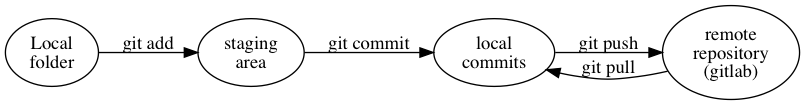

= Version control and git

When we write code, we are doing changes constantly; in programming, we figured out ways to name the changes and make them explicit; we call this *version control*. You will be using version control throughout your career, so you may want to make sure you learn it well.

There are many version control systems; We will use `git`, one of the most popular ones.

== Terminology
- *commit* - A set of changes to a set of files.
- *repository* - (commonly abbreviated as repo) a set of files and folders, with all their history of changes.
- *local repository* - a folder on the local machine, which also contains the history of changes to all files in that folder
- *remore repository* - a git repository that is not stored on the local machine

== Basic concepts

In your machine, you keep your files in a folder, with some metadata, which makes it a *repository* (the metadata is stored in a folder called `.git`, in case you care).

You make changes to those files, usually with a text editor, or IDE (or maybe by creating folders, or creating empty files, or using some other commands). At any time, you can see which files you've changed by running `git status`.

Once you have a set of changes you like, you need to *commit* them into your local repo. When you create a commit, you need to provide a comment, which works like a title for the commit (most times, you want to use a meaningful comment, so you can later remember what you did).

To allow for extra flexibility when committing, git first requires you to *stage* your changes; so committing is usually a two-step process.

1. Use `git add` to stage some files (or the changes to them)
2. Use `git commit` to commit those changes, adding a comment to them. Notice this creates a logical grouping of the changes.

To allow for sharing your changes (and also as a backup), you want to have more than one copy of your repository; that is, you want to have one or more *remote repositories* (we will use gitlab.com to keep our remote repos; I create a shared remote repo for each student; shared between you and me). You use `git push` to push the changes to a remote repository.

If we make changes in the remote repository through another machine, then we can use `git pull` to bring those changes into the local repo.

== Branches

Many times we want to keep to keep different set of changes separate from each other. In git (and most other version control systems) we do this by creating *branches*. Every repo has at least one distinguished branch, called *master*. Many times, you will create branches to keep your work on different features separate.

Notice your local and remote repositories may contain a different set of branches ! It is usually a good idea to keep these consistent, and map every local branch to a remote one with the same name.

The command `git branch` lists all the existing branches in the local repo, and `git branch -r` lists the existing branches in the local repo.

=== Merging 
After we are done with a feature (or at other times, depending on practicality) we can *merge* our branch (usually into master). Merging one branch into another copies all the commits from the first one into the second one. Notice this is NOT a reflexive operation; merging branch a into branch b applies all of a's commits into b, but b may have other commits.

=== merge conflicts

When we try to merge two branches, they may have commits that conflict; that is, two commits say to make different changes to the same file. Many times, git can figure out how to automatically resolve these conflicts (by figuring out that the changes happened in different parts of the file), but not always. Some times, you need to manually merge changes (git will add special markers to the file, and you will manually edit them and then add them to a commit).

It makes your life easier if you do not have merge conflicts. In cases where many people are collaborating on a set of files, this is not always avoidable, but, given you (and maybe myself) are the only one who will be changing the files, a little discipline can help you avoid them.

== Our branching model

The different assignments reside in different folders (a1, a2, etc). You will create a branch with the same name (a1, etc), and only add files in the corresponding folder. This way, I know what assignment a merge request is for, and we ensure there are no merge conflicts (since branch a1 will only contain changes to files in the a1 folder, a2 on a2 and so on).

== Commands

- `git` - by itself will print help information about what you can do with git
- `git status` - prints the current branch, files that have changed, and whether they are staged or not
- `git log` - prints all the commits in the current branch
- `git checkout` - changes branch. With the `-b` option creates a new branch.

